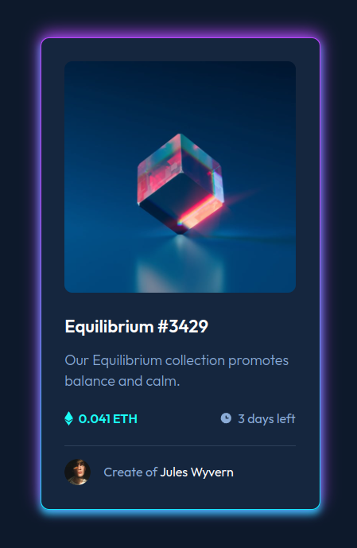

# Equilibrium Collection

Welcome to the Equilibrium Collection project! This is a React application card

## Features

- Display of collection items with images, descriptions, pricing, and creator information.
- Hover effects for enhanced user experience.
- Responsive design for optimal viewing across devices.
- Integration with React for dynamic rendering and component-based architecture.



## Installation

To run this project locally, follow these steps:

1. Clone this repository to your local machine using `git clone`.
2. Navigate to the project directory in your terminal.
3. Install dependencies by running `npm install`.
4. Start the development server with `npm start`.
5. Open your browser and visit `http://localhost:3000` to view the application.

## Technologies Used

- React: A JavaScript library for building user interfaces.
- CSS: Cascading Style Sheets for styling the application.
- HTML: Hypertext Markup Language for structuring web pages.

## HTML and CSS for nice rotating glow outer border

```html
<div class="outfit">
  <div class="container"></div>
</div>
```

```css
.outfit {
  background-image: linear-gradient(rgb(186, 66, 255) 35%, rgb(0, 225, 255));
  width: 100px;
  height: 100px;
  animation: spinning82341 1.7s linear infinite;
  text-align: center;
  border-radius: 50px;
  filter: blur(1px);
  box-shadow: 0px -5px 20px 0px rgb(186, 66, 255), 0px 5px 20px 0px rgb(0, 225, 255);
}

.container {
  background-color: rgb(36, 36, 36);
  width: 100px;
  height: 100px;
  border-radius: 50px;
  filter: blur(10px);
}

@keyframes spinning82341 {
  to {
    transform: rotate(360deg);
  }
}
```
